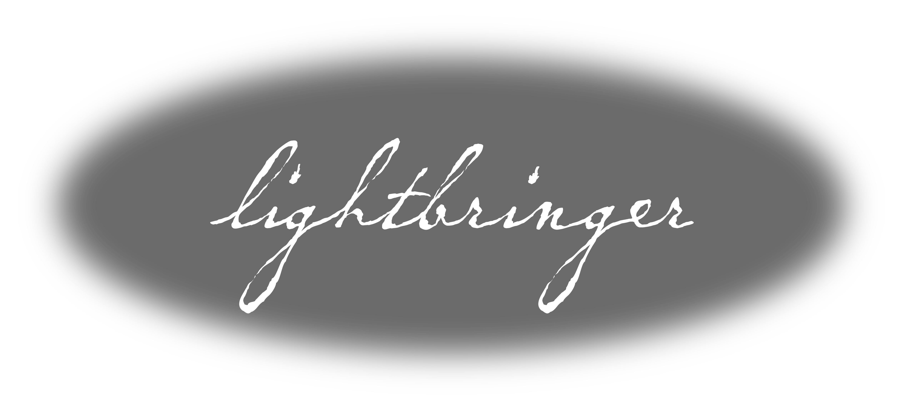

# Lightbringer
A 2D adventure platformer where you play as Wick, a bringer of light to a land of darkness. Made for Pirate Software Game Jam 16.

Lightbringer is playable here on itch.io: https://kevinpfeifle.itch.io/lightbringer

You are Wick, the last Lightbringer left to restore the world back to light. You hold within you the light to defeat the darkness. Your mission is to illuminate/revive the now dashed holders of light. Avoid/eliminate the darkness while keeping your light aflame and defeat the darkness harvester. The catch is, you only have so much light, and limited replenishment resources, so you must think strategically on when to use your light to defeat enemies.

## Screenshots

